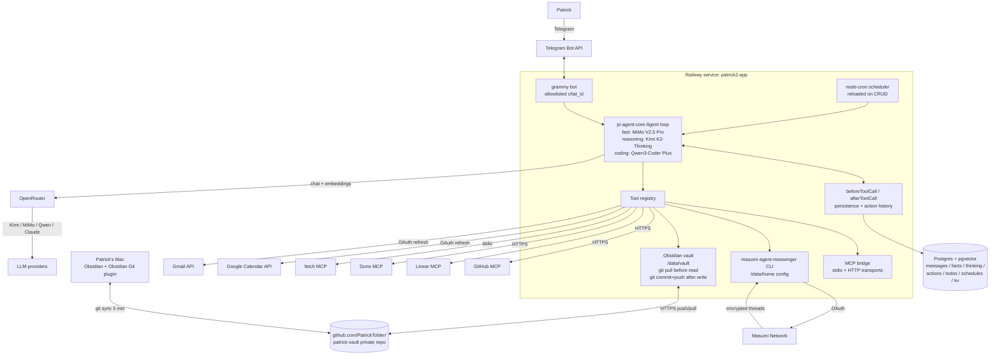
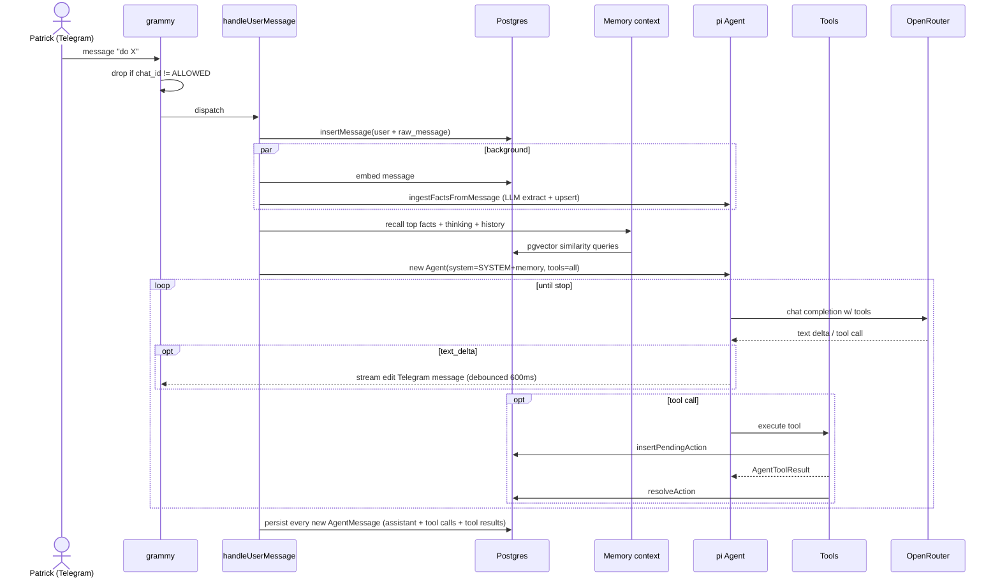
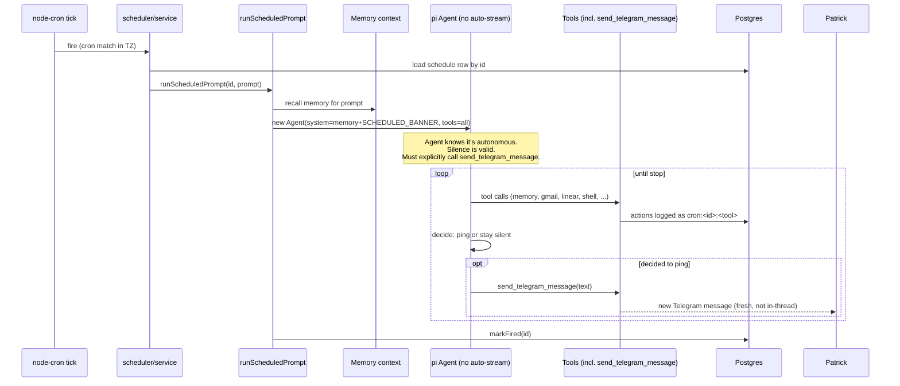
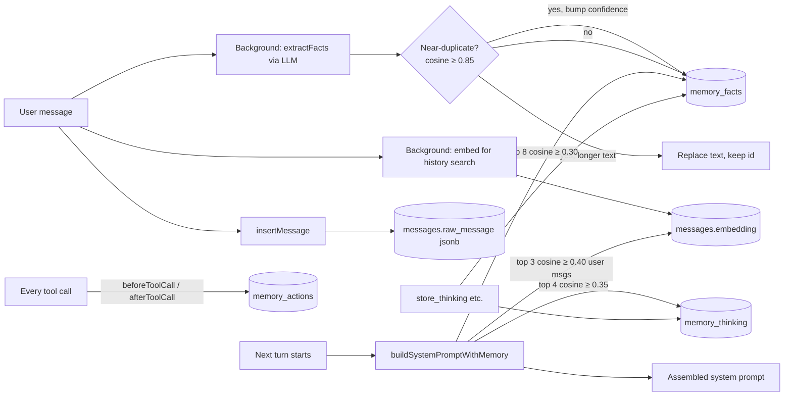

# patrick2.0

Personal assistant agent — a digital clone of Patrick. Talks to him over Telegram, runs on Railway, accumulates a model of how he thinks over time.

**Goal:** "Feels like a clone of me." Not "an AI that helps Patrick." A digital twin that absorbs his preferences, evolving thinking, and action history, then acts as an extension of him.

Specs are in [`SPECS.md`](./SPECS.md). This README is the architecture reference.

---

## Architecture

### System diagram



### Inbound Telegram message lifecycle



### Scheduled prompt lifecycle



### Memory write + recall path



### Vault (Obsidian) sync lifecycle

```mermaid
flowchart LR
    PATRICK[Patrick edits note<br/>in Obsidian on Mac]
    PATRICK -->|Obsidian Git plugin<br/>auto-commit every 5 min| VAULT_REPO

    VAULT_REPO[(GitHub<br/>patrick-vault)] -->|git pull --rebase<br/>before any read| VAULT_FS
    VAULT_FS[/data/vault<br/>Railway volume] -->|read_note / search_notes| AGENT[Agent]

    AGENT -->|write_note / append_note| VAULT_FS
    VAULT_FS -->|git add + commit + push<br/>after every write| VAULT_REPO

    VAULT_REPO -->|git pull every 5 min<br/>in Obsidian Git plugin| PATRICK
```

---

## ASCII box diagram (if Mermaid doesn't render)

```
┌─────────────┐     long-poll        ┌────────────────────────────────────────┐
│  Telegram   │ ←───────────────────→│  patrick2.0 service (Railway)          │
│  @padierfind│                      │                                        │
│   _2_0_bot  │                      │  ┌──────────────────────────────────┐  │
└─────────────┘                      │  │  pi-agent-core Agent loop        │  │
                                     │  │  (badlogic/pi-mono framework)    │  │
                                     │  │                                  │  │
                                     │  │  - LLM router → OpenRouter       │  │
                                     │  │    fast: MiMo V2.5 Pro           │  │
                                     │  │    reasoning: Kimi K2-Thinking   │  │
                                     │  │    coding: Qwen3-Coder Plus      │  │
                                     │  │  - Tool registry                 │  │
                                     │  │  - beforeToolCall /              │  │
                                     │  │    afterToolCall hooks           │  │
                                     │  │  - Streaming events              │  │
                                     │  └──────────────────────────────────┘  │
                                     │             │                          │
                                     │             ▼                          │
                                     │  ┌──────────────────────────────────┐  │
                                     │  │  Tools surfaced to the model     │  │
                                     │  │                                  │  │
                                     │  │  • Memory:  facts, thinking,     │  │
                                     │  │             time, actions        │  │
                                     │  │  • Vault:   list/read/write/     │  │
                                     │  │             search/append        │  │
                                     │  │  • Google:  Calendar (3),        │  │
                                     │  │             Gmail (4)            │  │
                                     │  │  • Schedules: add/list/update/   │  │
                                     │  │             pause/resume/delete  │  │
                                     │  │  • Shell:   run_shell            │  │
                                     │  │  • Skills:  list/read/reload     │  │
                                     │  │             (12 bundled)         │  │
                                     │  │  • Subagents (8): coder,         │  │
                                     │  │     researcher, github, linear,  │  │
                                     │  │     dune, web, moltbook, reddit  │  │
                                     │  └──────────────────────────────────┘  │
                                     │                                        │
                                     │  ┌──────────────────────────────────┐  │
                                     │  │  Persistence                     │  │
                                     │  │  • Postgres + pgvector (Railway) │  │
                                     │  │  • Vault on /data volume (git)   │  │
                                     │  └──────────────────────────────────┘  │
                                     └─────────┬──────────────┬──────────────┘
                                               │              │
                                               ▼              ▼
                                     ┌──────────────┐  ┌─────────────────┐
                                     │  Postgres    │  │ github.com/     │
                                     │  + pgvector  │  │ PatrickTobler/  │
                                     │  (Railway)   │  │ patrick-vault   │
                                     └──────────────┘  └─────────────────┘
```

---

## Stack

| Layer | Choice | Why |
|---|---|---|
| Runtime | Node.js 22 + TypeScript (ESM, strict) | Pi-mono is TypeScript |
| Agent framework | `@mariozechner/pi-agent-core` + `@mariozechner/pi-ai` | The "use pi as much as possible" principle |
| LLM gateway | OpenRouter | Single key, switch models by id, embeddings + chat |
| Telegram | `grammy` | Mature, typed, allowlist middleware |
| DB | Postgres + pgvector | Memory needs semantic recall |
| Migrations | `node-pg-migrate` | Plain JS, runs at container start |
| Lint/format | Biome | Fast, single config |
| Tests | Vitest | Standard for ESM TS |
| Logging | Pino + redaction | Structured JSON, never logs API keys |
| Deploy | Railway | One service + Postgres + volume |

---

## The agent loop (per Telegram message)

```
user sends "X" on Telegram
  │
  ├─ grammy middleware: drop if chat_id != ALLOWED_CHAT_ID
  │
  ├─ insertMessage({ role:"user", content:"X" })
  │     └─ background: embed and write embedding column
  │
  ├─ build system prompt:
  │     SYSTEM_PROMPT
  │     + skills inventory (29 bundled, name + description)
  │     + recallFacts("X")     → top 8 facts above 0.30 sim
  │     + recallThinking("X")  → top 4 thoughts above 0.35 sim
  │     + searchHistory("X")   → top 3 prior user messages above 0.40 sim
  │
  ├─ load last 50 messages from DB → AgentMessage[]
  │
  ├─ new pi Agent({
  │       systemPrompt: <augmented>,
  │       model: chooseModel("fast")     // Kimi K2.5
  │       tools: [native, vault, google, skills, mcp, subagents]
  │       beforeToolCall: insertPendingAction(tool, args)
  │       afterToolCall:  resolveAction(id, outcome, output)
  │   })
  │
  ├─ background: ingestFactsFromMessage("X")
  │     - LLM extract step → 0..N candidate facts
  │     - upsertFact(text) for each → dedupe via pgvector cosine
  │
  ├─ agent.prompt("X")
  │     ├─ pi calls model with full context
  │     ├─ on text_delta → buffer + debounced edit_message_text
  │     ├─ on tool_call  → execute → afterToolCall hook
  │     └─ may loop: model → tool → model → ... until done
  │
  └─ insertMessage({ role:"assistant", content:<final text> })
```

---

## Memory layers (the core IP)

Everything in Postgres. Embeddings are 1536-dim from `openai/text-embedding-3-small` via OpenRouter.

| Table | Purpose | Recall |
|---|---|---|
| `messages` | Every Telegram turn (user + assistant) | Semantic search via embedding column (HNSW index) + tsvector hybrid |
| `memory_facts` | Stable truths about Patrick | Cosine top-K (HNSW), dedupe at sim ≥ 0.85 (longer phrasing wins), confidence-weighted with daily decay |
| `memory_thinking` | Evolving positions, in-progress reasoning | Semantic top-K + topic tag filter |
| `memory_actions` | Every tool call: input, output, outcome | By tool, by outcome, by time |
| `notes` | Free-form notes (currently unused — vault is preferred) | n/a |
| `todos` | Native task store (currently disabled — Patrick uses Linear; table kept for historical data) | n/a |
| `schedules` | Cron schedules for proactive prompts | Loaded at boot + reloaded on CRUD via tools |
| `kv` | Generic key-value (config, state) | Direct |

**Critical distinction enforced in the system prompt:** facts are stable, thinking is evolving. "I prefer async" → fact. "I'm starting to think the right play is X because Y" → thinking.

**Auto-extraction:** after every user message, a background LLM call extracts candidate stable facts and upserts them. Dedupe is cosine similarity ≥ 0.85; the longer phrasing wins on merge so detail accumulates rather than getting lost.

**Memory injection:** `buildSystemPromptWithMemory(userText)` runs before every turn. The model sees relevant facts, recent thinking, and matching past messages stitched into the system prompt — no separate retrieval tool needed.

---

## Tools surfaced to the model

Total surface for the main reactive agent: **~31 native tools + 8 subagents = ~39 tool schemas** in every LLM call. MCP servers (~100+ tools across github/linear/dune/fetch) are no longer surfaced raw — they're scoped behind domain subagents so the main agent's prompt stays tight. Bundled skill *names + descriptions* are listed in the system prompt; full SKILL.md content loads on demand via `read_skill`.

### Native (built in this repo)
| Tool | Group | What |
|---|---|---|
| `remember_fact`, `list_facts`, `forget_fact` | Memory | Stable facts about Patrick (confidence-weighted, daily decay) |
| `store_thinking`, `recall_thinking`, `list_thinking` | Memory | Evolving positions |
| `current_time` | Time | Now in Patrick's tz, for resolving "tomorrow" → ISO |
| `query_actions` | Memory | Audit tool history |
| `list_skills`, `read_skill`, `reload_skills` | Skills | Discover + load skill files |
| `list_mcp_servers` | Meta | Status of connected MCP servers |
| `list_notes`, `read_note`, `search_notes`, `write_note`, `append_note` | Vault | Read/write Obsidian via git sync |
| `list_events`, `create_event`, `delete_event` | Google Calendar | Direct API via OAuth refresh |
| `list_emails`, `read_email`, `draft_email`, `send_draft` | Gmail | Drafts always require explicit Patrick approval |
| `add_schedule`, `list_schedules`, `update_schedule`, `pause_schedule`, `resume_schedule`, `delete_schedule` | Schedules | Cron-style proactive prompts; service auto-reloads on CRUD |
| `run_shell` | Shell | Sandboxed `execFile` (not a real shell — args stay separate, env passes through) |
| `delegate_to_coder`, `delegate_to_researcher`, `delegate_to_github`, `delegate_to_linear`, `delegate_to_dune`, `delegate_to_web`, `delegate_to_moltbook`, `delegate_to_reddit` | Subagents | Spawn focused sub-Agents (see table below) |

> Native todo tools (`add_todo`, etc.) are **disabled** — Patrick uses Linear via the linear subagent. Code path is intact, table is kept; re-enable by adding `todoTools` back in `src/agent/loop.ts`.

> The scheduled-prompt runner additionally exposes `send_telegram_message` and `send_telegram_photo` so cron-fired agents can ping Patrick proactively. These are not on the reactive path (a reactive reply just streams into the existing chat).

### Skills (bundled in `./skills/`, loaded via Agent Skills standard)
Progressive disclosure: only `name + description` are in the system prompt; the agent calls `read_skill` to load full SKILL.md content on demand.

| Bundled (12) | Purpose |
|---|---|
| `ads-google` / `meta` / `linkedin` / `tiktok` / `microsoft` / `apple` / `youtube` | Per-platform paid ad analysis |
| `obvious-communication` | Plain-language writing principles (Obvious Adams, 1916) |
| `fal-ai` | Generate images/video/audio via fal.ai (FAL_KEY env) |
| `gtm-cli` | GTM tag management + Meta Ads API queries |
| `wise-bank` | Wise account/transaction queries (WISE_API_TOKEN env) |
| `masumi-agent-messenger` | Encrypted agent-to-agent inboxes via the masumi CLI |

In dev mode the loader also reads `~/.claude/skills/`, so Patrick's full local skill library is available alongside the bundled set.

### MCP servers (HTTP + stdio bridge — accessed via subagents only)
The MCP bridge boots in the background, connects each server, and wraps every MCP tool as an `AgentTool` named `mcp_<server>__<tool>`. **The main agent never sees these tools directly** — it delegates to a domain subagent (see below), which is the only consumer scoped to that server's tool prefix. Failed servers log a warning and don't block startup.

| Server | Auth | Approx tool count | Consumed by |
|---|---|---|---|
| github | `GITHUB_TOKEN` (HTTP) | ~40 | `delegate_to_github`, `delegate_to_coder` |
| linear | `LINEAR_API_KEY` (npx stdio) | ~40 | `delegate_to_linear` |
| dune | `DUNE_API_KEY` (HTTP) | ~20 | `delegate_to_dune` |
| fetch | none (npx stdio) | 1 | `delegate_to_web`, `delegate_to_researcher`, `delegate_to_coder` |

In dev mode, additional MCP servers from `~/.claude.json` get loaded (obsidian, google-docs, etc.) — those are local-only and not portable to Railway.

### Subagents
A subagent is a tool whose `execute` spawns a fresh `Agent` with a focused system prompt + scoped tool set, runs it to completion via `runSubagent`, returns the final text + a turn count. Eight are wired into the main agent today.

| Subagent | Model | Scoped tools |
|---|---|---|
| **coder** (`delegate_to_coder`) | `qwen/qwen3-coder-plus` (1M ctx, coding-specialized) | github MCP, fetch MCP, vault, facts |
| **researcher** (`delegate_to_researcher`) | `moonshotai/kimi-k2-thinking` (262k ctx, reasoning) | fetch MCP, vault, facts, recall_thinking |
| **github** (`delegate_to_github`) | fast (MiMo V2.5 Pro) | github MCP only |
| **linear** (`delegate_to_linear`) | fast | linear MCP only |
| **dune** (`delegate_to_dune`) | fast | dune MCP only |
| **web** (`delegate_to_web`) | fast | fetch MCP only |
| **moltbook** (`delegate_to_moltbook`) | fast | shell, vault, facts (uses `MOLTBOOK_API_KEY` + `SOKOSUMI_API_KEY` from env via shell) |
| **reddit** (`delegate_to_reddit`) | fast | shell, vault, facts (drives a stealth Browserbase Chromium session through residential proxies; cookies persisted in a Browserbase context cached on `/data`) |

The four MCP-domain subagents (github/linear/dune/web) all share one factory in `src/agent/subagents/mcp-domain.ts` — pass a spec (tool name, MCP prefix, system prompt) and you get a delegating subagent. Adding a new MCP server is a 1-line spec.

---

## Vault (Obsidian) sync

Patrick's Obsidian vault is mirrored to a private GitHub repo `PatrickTobler/patrick-vault`. The bot clones it to `/data/vault` (a Railway volume) on first boot, pulls before every read, commits + pushes after every write. Auth uses the bot's `GITHUB_TOKEN` (no separate deploy key).

On Patrick's Mac, the **Obsidian Git plugin** auto-pulls every 5 min and auto-pushes every 5 min. Two-way sync, both ends free to write. Conflict warning: if both edit the same file simultaneously, manual rebase.

`.gitignore` in the vault excludes `.obsidian/workspace*.json` (UI state churns and would conflict constantly).

---

## Google OAuth (Calendar + Gmail)

One Google Cloud Desktop OAuth client covers both APIs. Scopes:
- `calendar` (full read/write)
- `gmail.readonly`, `gmail.modify`, `gmail.send`
- `userinfo.email`

The one-time auth runs locally via `scripts/google-oauth.ts` (loopback flow on `localhost:8765`). Result: a long-lived **refresh token** stored as `GOOGLE_REFRESH_TOKEN` env var. The bot exchanges it for short-lived access tokens at runtime, cached in memory until 1 min before expiry.

`gmail.send_draft` requires explicit Patrick approval per the spec — never auto-sends.

---

## Pi-first principle

Use pi-mono primitives wherever they exist. We don't write a custom agent loop, custom tool runtime, or custom skill loader. Concretely:

| Pi primitive | Where we use it |
|---|---|
| `Agent` class | Main loop in `src/agent/loop.ts`; subagent runner in `src/agent/subagents/runner.ts` |
| `AgentTool` | Every tool: facts, thinking, todos, vault, gmail, calendar, skill discovery, subagents, MCP |
| `convertToLlm` | Pass-through (we already use Message shape) |
| `transformContext` | Memory injection happens in our system prompt build instead — equally valid, cleaner for this case |
| `beforeToolCall` / `afterToolCall` hooks | Action history (F1.4) — every tool call logged with input + outcome |
| `getApiKey` | Inject OpenRouter key per-request |
| Streaming events | Telegram message edit-in-place |

Pi has no native MCP client → we wrote `src/mcp/{client,bridge,config}.ts` using `@modelcontextprotocol/sdk`.
Pi has no native skills loader exported (it's internal to the coding-agent package) → we wrote `src/skills/loader.ts` to the same Agent Skills spec.

---

## Code layout

```
patrick2.0/
├── src/
│   ├── index.ts                  # entry: boot bot + MCP bridge + scheduler + masumi refresher + decay job
│   ├── config.ts                 # env var loading + validation
│   ├── log.ts                    # pino logger with PII redaction
│   │
│   ├── telegram/
│   │   └── bot.ts                # grammy bot, allowlist, dispatcher
│   │
│   ├── agent/
│   │   ├── loop.ts               # handleUserMessage — reactive turn flow
│   │   ├── scheduled-runner.ts   # autonomous cron-fired runs (no user channel; tools include send_telegram_message)
│   │   ├── system-prompt.ts      # base prompt
│   │   ├── memory-context.ts     # cache-aware split: stable prefix + per-turn recall
│   │   ├── facts.ts              # background fact extractor (LLM-driven, confidence-weighted)
│   │   ├── tools/                # one file per tool family
│   │   │   ├── facts.ts
│   │   │   ├── thinking.ts
│   │   │   ├── todos.ts          # currently unused — Patrick uses Linear
│   │   │   ├── time.ts
│   │   │   ├── actions.ts
│   │   │   ├── schedules.ts      # cron-style proactive prompts
│   │   │   ├── shell.ts          # sandboxed run_shell (execFile, args separated)
│   │   │   ├── telegram.ts       # send_telegram_message / send_telegram_photo (scheduled-only)
│   │   │   ├── skills.ts
│   │   │   ├── mcp-meta.ts
│   │   │   ├── vault.ts
│   │   │   ├── calendar.ts
│   │   │   └── gmail.ts
│   │   └── subagents/
│   │       ├── runner.ts         # generic runSubagent helper
│   │       ├── coder.ts          # Qwen3-Coder Plus + GitHub + fetch + vault
│   │       ├── researcher.ts     # Kimi K2-Thinking + fetch + vault
│   │       ├── mcp-domain.ts     # factory for github/linear/dune/web domain subagents
│   │       ├── moltbook.ts       # Moltbook engagement (shell + vault, MOLTBOOK + SOKOSUMI keys)
│   │       └── reddit.ts         # Reddit via Browserbase + residential proxies
│   │
│   ├── scheduler/
│   │   └── service.ts            # node-cron registry; reloaded on schedule CRUD
│   │
│   ├── masumi/
│   │   └── auth-refresher.ts     # 45-min OAuth refresh into masumi-agent-messenger CLI secrets store
│   │
│   ├── maintenance/
│   │   └── decay.ts              # daily fact-confidence decay job
│   │
│   ├── llm/
│   │   ├── router.ts             # model class → Model<openai-completions> over OpenRouter (reasoning/fast/cheap/coding)
│   │   └── embeddings.ts         # OpenRouter embeddings client (text-embedding-3-small)
│   │
│   ├── db/
│   │   ├── pool.ts               # pg pool singleton
│   │   └── repos/                # one file per table
│   │       ├── messages.ts
│   │       ├── facts.ts
│   │       ├── thinking.ts
│   │       ├── actions.ts
│   │       ├── schedules.ts
│   │       └── todos.ts
│   │
│   ├── google/
│   │   ├── auth.ts               # OAuth refresh-token → access-token cache
│   │   ├── calendar.ts           # Calendar v3 API client
│   │   └── gmail.ts              # Gmail v1 API client
│   │
│   ├── mcp/
│   │   ├── config.ts             # load MCP server configs (builtin + ~/.claude.json in dev)
│   │   ├── client.ts             # connect via stdio or HTTP transport
│   │   └── bridge.ts             # wrap MCP tools as AgentTool[]
│   │
│   ├── skills/
│   │   └── loader.ts             # Agent Skills spec loader (frontmatter parser, dedupe)
│   │
│   └── vault/
│       ├── sync.ts               # git clone/pull/commit/push wrappers
│       └── notes.ts              # safe path resolution + read/write/search
│
├── skills/                       # bundled SKILL.md files (baked into Docker image)
│   ├── ads-apple/  ads-google/  ads-linkedin/  ads-meta/
│   ├── ads-microsoft/  ads-tiktok/  ads-youtube/
│   ├── fal-ai/  gtm-cli/  masumi-agent-messenger/
│   ├── obvious-communication/
│   └── wise-bank/
│       ├── SKILL.md
│       └── wise_query.sh
│
├── migrations/                   # node-pg-migrate, run at container start
│   ├── 1700000000000_init.cjs
│   ├── 1700000001000_messages_embedding.cjs
│   ├── 1700000002000_todos.cjs
│   ├── 1700000003000_messages_raw.cjs           # full AgentMessage jsonb (preserves tool calls + results)
│   ├── 1700000004000_schedules.cjs              # cron schedule store
│   ├── 1700000005000_tsvector_hybrid.cjs        # fulltext + vector hybrid search
│   └── 1700000006000_hnsw_indexes.cjs           # HNSW for facts + messages embeddings
│
├── scripts/
│   └── google-oauth.ts           # one-time OAuth flow runner
│
├── Dockerfile                    # multi-stage: build TS, prune dev deps, install git + bash + masumi-agent-messenger CLI
├── package.json
├── tsconfig.json / tsconfig.build.json
├── biome.json
├── vitest.config.ts
├── .env.example
└── SPECS.md                      # the original spec (north star, features, tests)
```

---

## Environment variables

| Var | Required | Purpose |
|---|---|---|
| `OPENROUTER_API_KEY` | yes | Chat + embeddings |
| `TELEGRAM_BOT_TOKEN` | yes | BotFather token |
| `TELEGRAM_OWNER_CHAT_ID` | yes | Patrick's numeric Telegram id (allowlist) |
| `DATABASE_URL` | yes | Postgres URL (Railway internal in prod) |
| `NODE_ENV` | no | `production` switches off dev-only paths (e.g. `~/.claude.json` MCP loading) |
| `LOG_LEVEL` | no | pino level, default `info` |
| `TELEGRAM_WEBHOOK_URL` | no | If set, switches grammy from long-poll to webhook |
| `VAULT_REPO` | no | Git URL of the Obsidian vault repo (default `github.com/PatrickTobler/patrick-vault`) |
| `VAULT_DIR` | no | Where to clone the vault, default `/data/vault` |
| `GITHUB_TOKEN` | no | Auth for GitHub MCP + vault git push |
| `LINEAR_API_KEY` | no | Linear MCP |
| `DUNE_API_KEY` | no | Dune MCP |
| `GOOGLE_CLIENT_ID` | no | OAuth client (Calendar + Gmail) |
| `GOOGLE_CLIENT_SECRET` | no | OAuth client secret |
| `GOOGLE_REFRESH_TOKEN` | no | Long-lived refresh token from `scripts/google-oauth.ts` |
| `FAL_KEY` | no | fal.ai (used by `fal-ai` skill) |
| `WISE_API_TOKEN` | no | Wise (used by `wise-bank` skill) |
| `META_ADS_TOKEN`, `META_PIXEL_ID`, `META_AD_ACCOUNT_ID` | no | Meta Ads (used by `gtm-cli` skill) |
| `MOLTBOOK_API_KEY` | no | Moltbook subagent — Bearer token for `api.moltbook.com` |
| `SOKOSUMI_API_KEY` | no | Moltbook subagent — Bearer token for `masumi-agent-messenger` Elena thread replies |
| `BROWSERBASE_API_KEY`, `BROWSERBASE_PROJECT_ID` | no | Reddit subagent — stealth Chromium session host |
| `REDDIT_EMAIL`, `REDDIT_PASSWORD` | no | Reddit subagent — login credentials (account dedicated to this bot) |
| `MASUMI_AGENT_BACKUP_B64`, `MASUMI_AGENT_BACKUP_PASSPHRASE` | no | First-boot restore of masumi-agent-messenger namespace keys on Railway volume |

---

## Local development

```bash
# Install deps + run tests
npm install
npm test
npm run check    # biome + tsc

# Run the bot locally (long-poll Telegram)
cp .env.example .env
# fill in the 4 required vars at minimum
npm run dev
```

Migrations need to be applied to the configured `DATABASE_URL`:

```bash
npm run migrate:up
```

The OAuth flow for Google (one-time):

```bash
GOOGLE_CLIENT_ID=... GOOGLE_CLIENT_SECRET=... npx tsx scripts/google-oauth.ts
# Copy the printed GOOGLE_REFRESH_TOKEN into your .env or Railway env
```

---

## Deploy (Railway)

```bash
railway link    # if not linked already
railway up --service patrick2-app --ci
```

The Dockerfile:
1. Builds TS → `dist/`
2. Prunes dev deps
3. Installs `git`, `bash`, `ca-certificates` in the runtime image
4. Copies `dist/`, `migrations/`, `skills/` into the final stage
5. CMD runs migrations then starts the Node process

Railway resources:
- **patrick2-app** service (this code)
- **Postgres** service (manually created via GraphQL — pgvector image)
- Volume mounted at `/data` for the vault

---

## What's intentionally NOT here yet

Per [`SPECS.md`](./SPECS.md), the roadmap continues with:
- **F4** — most of proactivity is **landed** (scheduler service, schedules tools, autonomous scheduled-runner that may stay silent or ping via `send_telegram_message`). Still to do: opinionated wakeup recipes (morning briefing, T-10 meeting prep, urgent email watcher, EOD recap) on top of the generic scheduler.
- **F5** — approval flows, quiet hours, kill switch
- **F3** — personal channel ingestion (Telegram personal, Slack, WhatsApp read-only)
- **F7** — production hardening (backups, structured monitoring; webhook switch is wired via `TELEGRAM_WEBHOOK_URL`)
